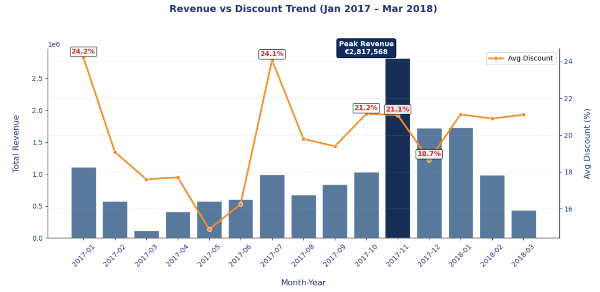

# 🚀 Eniac Discount Strategy Analysis  
### 📊 Data-Driven Pricing & Revenue Optimisation for E-commerce

---

## 🎯 Project Overview

This project analyzes the discounting strategy of **Eniac**, an e-commerce company, to evaluate whether discounts effectively drive revenue growth or reduce profitability efficiency.

The analysis focuses on:
- Impact of discount levels on revenue and sales volume  
- Role of seasonality in driving sales performance  
- Relationship between discounts and basket value  
- Identification of efficient vs inefficient discount strategies  

Using Python-based exploratory data analysis, this project translates raw transactional data into **actionable business insights for pricing optimization**.

---

## 📊 Dataset & Sources

## 📁 Raw Data Files
The dataset consists of transactional e-commerce sales data stored in Excel format. 

### Included Files 
- brands.xls
- orderlines.xls
- orders.xls
- products.xls

## 📦 Dataset Scope 

- **57,974 sold product entries analysed**
- Includes completed order transactions
- Covers discounts, revenue, brands, and seasonal sales trends


## 🔑 Key Features

- Revenue  
- Discount Percentage  
- Units Sold  
- Basket Value  
- Order Status  
- Brand Performance  
- Monthly Revenue Trends  

---

## 🧹 Data Processing

### 📂 Cleaned Data

- brands_cl.xls  
- orderlines_cl.xls  
- orders_cl.xls  
- products_cl.xls  

### 🧪 Quality Assessment

- orderlines_qua.xls  
- orders_qua.xls  

---

## 🚀 Key Findings

### 💰 Discounts Are Heavily Used
- 📌 93% of transactions include discounts  
- 📌 Average discount level: ~18.2%  
- 📌 Discounting is a core pricing strategy, not occasional promotion  

---

### 📉 Higher Discounts ≠ Higher Efficiency
- Low discounts (0–10%) generate **better revenue efficiency**  
- High discounts increase volume but reduce profitability per order  

---

### 📊 Seasonality Drives Revenue More Than Discounts
- Revenue peaks align strongly with seasonal trends  
- Discounts alone do not create sustained revenue growth  

---

### ⚖️ Excessive Discounting Reduces Value
- Deep discounts lead to lower revenue per unit  
- Targeted discounting outperforms blanket discount strategies  

---

### 🎯 Business Insight
👉 Discounts should be applied **strategically, not universally**

---

## 🛠️ Technologies Used

### 💻 Programming
- Python  

### 📚 Libraries
- pandas  
- numpy  
- matplotlib  
- seaborn  

### 🧪 Environment
- Jupyter Notebook  
- Google Colab  

---

## 📁 Project Structure

```bash
📦 eniac-discount-strategy-analysis/
│
├── 📂 Raw data/
│   ├── 📄 brands.xls
│   ├── 📄 orderlines.xls
│   ├── 📄 orders.xls
│   └── 📄 products.xls
│
├── 📂 cleaned dataframe/
│   ├── 📄 brands_cl.xls
│   ├── 📄 orderlines_cl.xls
│   ├── 📄 orders_cl.xls
│   └── 📄 products_cl.xls
│
├── 📂 jupyter notebook/
│   └── 📓 Eniac_Discount_Analysis.ipynb
│
├── 📂 presentation/
│   └── 📊 The_Discount_Strategy_Analysis.pptx
│
├── 📂 quality assessment/
│   ├── 📄 orderlines_qua.xls
│   └── 📄 orders_qua.xls
│
├── 📂 screenshots/
│   ├── 🖼️ AOV by discount level.png
│   ├── 🖼️ average revenue per orderline.png
│   ├── 🖼️ completed order.png
│   ├── 🖼️ seasonal.png
│   ├── 🖼️ top brands.png
│   └── 🖼️ unit sold vs discount bucket.png
│
├── ⚙️ .gitignore
└── 📘 README.md
```
---

## 📈 Visualisations & Business Insights

---

### 📌 1. Discount Penetration Overview

📊 **Insight:** Discounts are deeply embedded in Eniac’s pricing strategy.

- 93% of transactions include discounts  
- Discounting is a default pricing mechanism  
- Average discount level is ~18.2%


---

### 📌 2. Units Sold vs Discount Level

📊 **Insight:** Higher discounts increase volume but reduce efficiency.

- Low discounts generate higher revenue efficiency  
- High discounts increase sales volume but reduce profitability  
- Mid-range discounts perform best overall  


---

### 📌 3. Average Revenue per Order

📊 **Insight:** Moderate discounts outperform aggressive discounting.

- Revenue per order declines at high discount levels  
- Mid-range discount buckets maximize efficiency  
- Over-discounting reduces profitability  


---

### 📌 4. Seasonality vs Discount Impact

📊 **Insight:** Seasonality has stronger impact than discounts.

- Revenue peaks align with seasonal demand  
- Discounts alone do not create sustained growth  
- External demand factors dominate pricing impact  



---

### 📌 5. Top Brand Performance

📊 **Insight:** Strong brands generate revenue without heavy discounting.

- High-performing brands maintain revenue with minimal discounts  
- Brand strength reduces dependency on promotions  
- Excessive discounting is unnecessary for top brands  


---


## 🔗 Project Links

### 📂 GitHub Repository  
👉 https://github.com/MerleSt/eniac-discount-strategy-analysis  

---

### 📘 Jupyter Notebook  
```bash
jupyter notebook Eniac_Discount_Analysis.ipynb

````
## 📊 Presentation  
👉 [View Presentation](https://github.com/MerleSt/eniac-discount-strategy-analysis/blob/main/presentation/The_Discount_Strategy_Analysis.pptx)


## ▶️ How to Use This Project

### 1️⃣ Clone Repository
📥 Download the project from GitHub to your local system.

[GitHub Repository](https://github.com/MerleSt/eniac-discount-strategy-analysis)

```bash
git clone https://github.com/MerleSt/eniac-discount-strategy-analysis.git
````
### 2️⃣ Open Notebook
📓 Open the Jupyter Notebook file to explore the analysis.

👉 Direct Notebook Link:
[View Notebook](https://github.com/MerleSt/eniac-discount-strategy-analysis/blob/main/jupyter%20noebook/Eniac_Discount_Analysis.ipynb)
jupyter notebook Eniac_Discount_Analysis.ipynb

### 3️⃣ Install Dependencies

📦 Install required Python libraries.
pip install pandas numpy matplotlib seaborn

### 4️⃣ Run Analysis

▶️ Execute all notebook cells sequentially to reproduce the analysis.
You can run it using:

📓 Jupyter Notebook (local system)
☁️ Google Colab (online platform)

## 🚀 Outcome

After running the project, you will be able to:

- 📊 Understand discount impact on revenue
- 📈 Analyze sales trends and seasonality
- 💡 Identify optimal pricing strategy insights


## 🚀 Future Improvements
- 📊 Profit margin analysis
- 🤖 Predictive pricing models
- 📈 Interactive dashboards (Power BI / Tableau)
- 👥 Customer segmentation impact
- ⚡ Real-time discount optimization system

---

## 📌 Conclusion

📊 This project explored whether discounts truly drive higher sales and revenue at Eniac.

The analysis shows that discounting is already heavily embedded in the company’s pricing strategy, with most products consistently sold below their base price.

---

### 💡 Key Findings

- 💰 Higher discounts can increase sales volume  
- 📉 However, they do not always improve revenue efficiency  
- 📊 Lower discount levels generated stronger average revenue performance  
- 📅 Revenue peaks are driven more by **seasonality** than aggressive discounting  
- ⚖️ Over-discounting reduces overall profitability efficiency  

---

### 🎯 Final Recommendation

👉 Discounts should be used **strategically and selectively**, not as a default pricing tool.

Targeted discounting for weaker products and seasonal campaigns can help:
- 📈 Improve revenue optimization  
- 🎯 Balance demand and profitability  
- 💡 Reduce unnecessary discount dependency  

---

### 🚀 Overall Insight

This project demonstrates how **data-driven pricing decisions** can:
- Improve business performance  
- Optimize revenue strategies  
- Support smarter decision-making in e-commerce pricing
Overall, this project demonstrates how data-driven pricing decisions can support smarter business strategies, improve revenue performance, and reduce unnecessary discount dependency.
